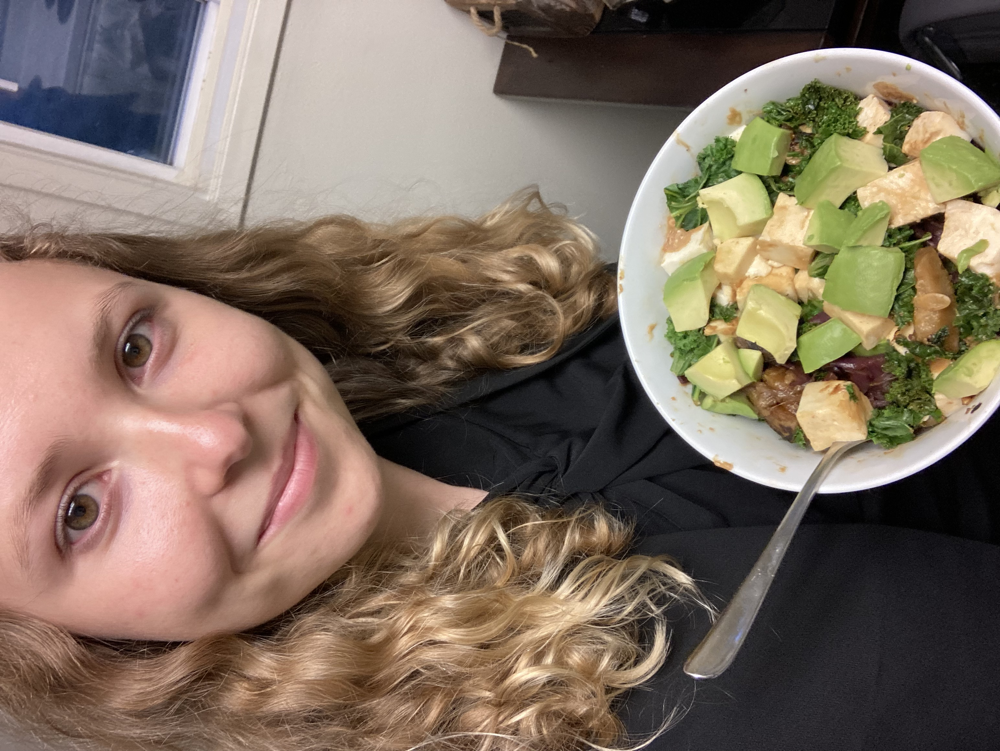

# Overview

This README is an example showing that I am able to write a markdown file containing headers, lists, links, embedded images, and tables. I'll demonstrate these skills by talking about my favorite foods.

## Foods I Love

- Beans and rice
- Dark leafy greens
- Avocados

Here is the proof:

# Nutrition

[Here](https://journals.sagepub.com/doi/10.1080/00048670701827275?url_ver=Z39.88-2003&rfr_id=ori:rid:crossref.org&rfr_dat=cr_pub%20%200pubmed) is a link to a study about how omega threes effect mood.

# Table of Preferences

| Food      |My Thoughts |
| ----------- | ----------- |
| Pie      | Love it       |
| Carne Asada   | Can't eat it      |
| Apple     | Best with PB       |
